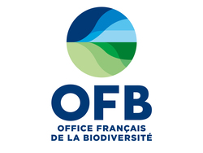

  
# Benchmark - Nouvelles méthodes de suivi innovantes de la fréquentation   Janvier 2024

## Contexte
Ce document est un complément non exhaustif de l’état de l’art réalisé par Aurélien Coste en mai 2023 lors de son stage au Parc National des Écrins. Il s’agit dans ce document, de compléter l’état de l’art de 2023 avec les nouvelles solutions disponibles depuis. L’ancien état de l’art est disponible ici : [État de l'art 2023](https://github.com/Attendance-PNE-OFB/docs/blob/main/%C3%89tat%20de%20l'art%20-%20M%C3%A9thodes%20de%20suivi%20innovantes.pdf)

## Technologies
### Huggingface.co
Huggingface.co est un site qui héberge de nombreux modèles et datasets déposés par une communauté d’utilisateurs. 
Il est possible de faire tourner un modèle via les “spaces” du site, certains sont payants d’autres sont gratuits. 
Il offre également des ressources pour entraîner des modèles. Bien qu’il existe de nombreux modèles et datasets différents, 
le site et ses utilisateurs actifs sont spécialisés dans les modèles de **NLP** (**N**atural **L**anguage **P**rocessing) qui portent essentiellement sur la compréhension, 
la manipulation et la génération du langage naturel par les machines. Exemples : Google translator, Siri, Chatbots, etc

### Kaggle
https://www.kaggle.com/

### CLIP
**CLIP** (**C**onstrastive **L**anguage-**I**mage **P**re-training) est un modèle développé par OpenAI. 
Le modèle combine des capacités de NLP et de vision par ordinateur afin de comprendre les relations entre images et texte. En effet, le modèle est capable de connecter un texte à une image. 
Il peut être appliqué à n’importe quel benchmark de classification visuelle en fournissant simplement les noms des catégories visuelles à reconnaître. 
Le modèle a été entraîné avec le dataset BigBiRD qui contient des paires textes-image, ainsi que le dataset Conceptual Captions
Néanmoins, CLIP obtient de moins bons résultats dans les tâches un peu plus abstraites ou spécifiques telles que le comptage du nombre d’objets dans une image.  

Comme CLIP n'a pas été entraînée sur le dataset COCO, j'ai décidé de tester sur une partie du dataset (5000 images) le taux de réussite de la classification.  
Pour faire cela, j'ai téléchargé le dataset [val2017](http://images.cocodataset.org/zips/val2017.zip) ainsi que les annotations correspondantes [annotations](http://images.cocodataset.org/annotations/annotations_trainval2017.zip). J'ai écrit un script qui récupère les informations des annotations dans le JSON afin de connaître le nombre d'individus par catégorie. Cependant, comme les annotations contiennent plusieurs catégories ou plusieurs individus pour une même image, on se rend rapidement compte d'un problème majeur.  
CLIP a besoin de prompts pour classifier, c'est à dire, qu'on saisi *x* prompts et CLIP classifie l'image dans l'un de ces *x* prompts. Pour notre cas, on a un problème majeur, comment CLIP va compter ? Comment CLIP va voir qu'il y a un humain et un chien sur la même image ? Pour que cela fonctionne, il faudrait indiquer dans les prompts tous les cas possibles, on arriverait très vite à des milliers de prompts pour avoir tous les cas possibles et ce n'est pas envisageable. CLIP n'est pas fait pour ce genre de tâches, il sait classifier avec du détail, mais il n'est pas adapté pour compter le nombre d'individus sur une même image. 
Néanmoins, une piste reste exploitable. Imaginons que CLIP nous sortes des prompts du style "Four people walking and a dog", "One person running", "Two kids". On pourrait alors imaginer faire un parseur de ces prompts pour récupérer les informations intéressantes qui sont le nombre d'individus et la "catégorie" de l'individu. On aurait alors par exemple avec ces trois prompts, 7 personnes et un chien. Un problème avec cette solution, c'est qu'il faut avoir de l'expérience avec le type de prompt que sort CLIP. Ici, j'ai écrit de trois manières différentes la même catégorie d'individus (people, person, kids) = 'humain'. Il faudrait alors soit avoir un parseur très puissant pour penser à tous les synonymes de chaque catégorie, soit voir dans quelles mesures on peut contrôler les prompts que sort CLIP, afin d'avoir des prompts similaires à chaque fois.
